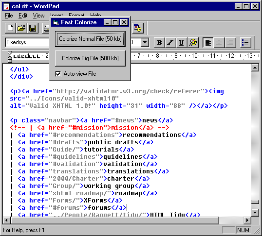



## Fast Colorize HTML / XML

### Description

[NOTE: THERE IS A NEWER VERSION] This routine shows how you can process nested search-replace operations on large strings (megabytes) with VB.

The program accepts a text-file as input and will output a colorized RTF file. Nothing new about that, but this program will generate large RTF files really fast because it uses a text buffer for string processing. You will see the difference if you try to colorize a 500+ kb XML file, most (all?) other 'colorize' programs on PSC that use native VB will fail on large files.
 
### More Info
 

             |
---                |---
**Submitted On**   |2001-10-13 17:33:18
**By**             |[Martijn B](https://github.com/Planet-Source-Code/PSCIndex/blob/master/ByAuthor/martijn-b.md)
**Level**          |Intermediate
**User Rating**    |5.0 (15 globes from 3 users)
**Compatibility**  |VB 6\.0
**Category**       |[String Manipulation](https://github.com/Planet-Source-Code/PSCIndex/blob/master/ByCategory/string-manipulation__1-5.md)
**World**          |[Visual Basic](https://github.com/Planet-Source-Code/PSCIndex/blob/master/ByWorld/visual-basic.md)
**Archive File**   |[Fast Color2888210132001\.zip](https://github.com/Planet-Source-Code/martijn-b-fast-colorize-html-xml__1-28059/archive/master.zip)

